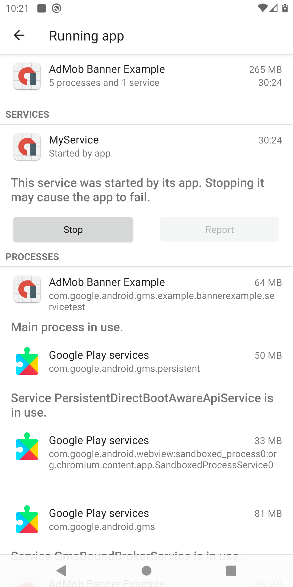

# Banner example with service

This is a test app with a permanently running foreground service and a banner ad.
It was created to debug some high RAM issues when the app is closed but the service is still runnning. 

This screenshot shows the running services after the app was closed.

